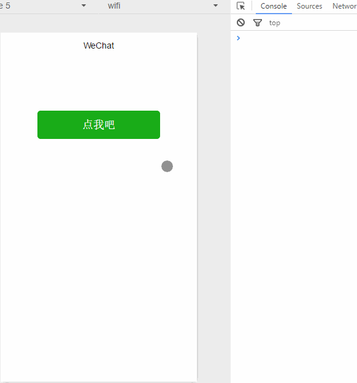
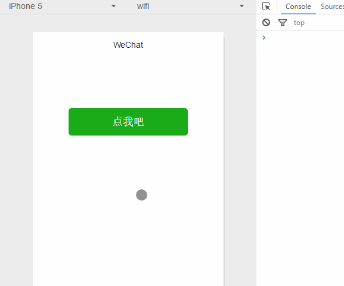
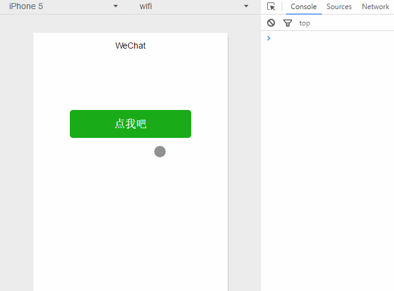
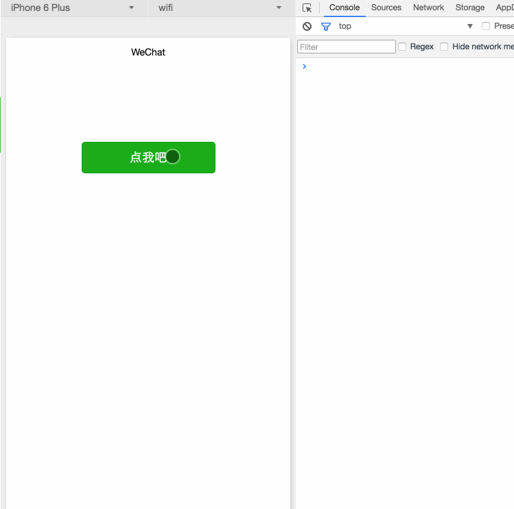
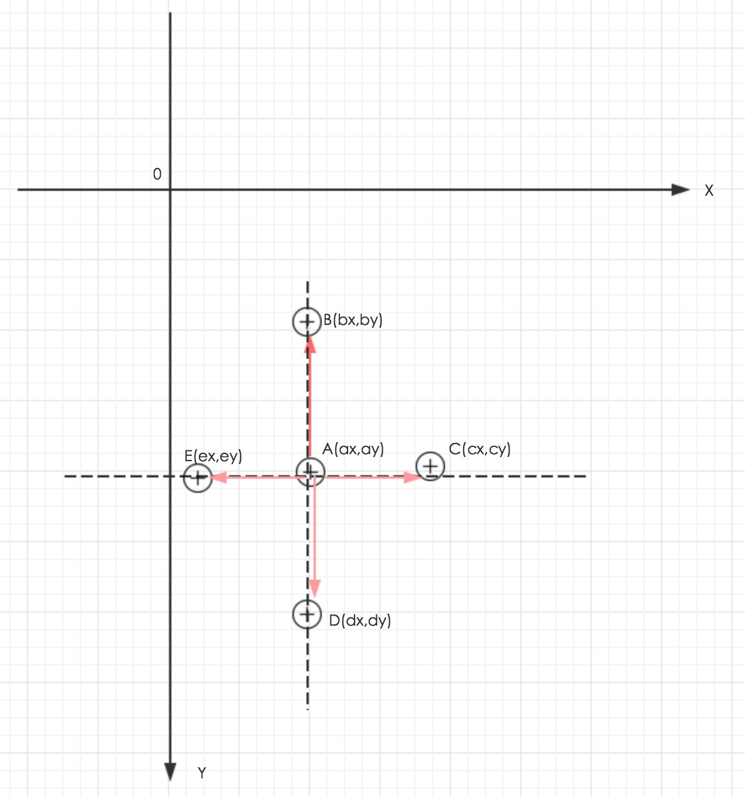

## 微信小程序之事件绑定

### 》》》什么是事件
- 事件是视图层到逻辑层的通讯方式。
- 事件可以将用户的行为反馈到逻辑层进行处理。
- 事件可以绑定在组件上，当达到触发事件，就会执行逻辑层中对应的事件处理函数。
- 事件对象可以携带额外信息，如id, dataset, touches。

### 》》》事件分类
- touchstart    手指触摸
- touchmove     手指触摸后移动
- touchcancel   手指触摸动作被打断，如弹窗和来电提醒
- touchend      手指触摸动作结束
- tap           手指触摸后离开
- longtap       手指触摸后后，超过350ms离开

### 》》》事件绑定

事件绑定的写法同组件的属性，以 key、value 的形式。

- key 以bind或catch开头，然后跟上事件的类型，如bindtap, catchtouchstart
- value 是一个字符串，需要在对应的 Page 中定义同名的函数。不然当触发事件的时候会报错。
bind事件绑定不会阻止冒泡事件向上冒泡，catch事件绑定可以阻止冒泡事件向上冒泡。

上面简单介绍了小程序事件基础，是时候彰显"事件"的威力：
- 单击(tap)
- 双击(dbtap)
- 长按(longtap)
- 滑动
- 多点触控

#### 1.单击
单击事件由touchstart、touchend组成,touchend后触发tap事件。



```html
<view>
  <button type="primary" bindtouchstart="mytouchstart" bindtouchend="mytouchend" bindtap="mytap">点我吧</button>
</view>
```

```javascript
mytouchstart: function(e){
    console.log(e.timeStamp + '- touch start')
},
mytouchend: function(e){
    console.log(e.timeStamp + '- touch end')
},
mytap: function(e){
    console.log(e.timeStamp + '- tap')
}
```

#### 2.双击
双击事件由两个单击事件组成，两次间隔时间小于300ms认为是双击；微信官方文档没有双击事件，需要开发者自己定义处理。



```html
<view>
  <button type="primary" bindtap="mytap">点我吧</button>
</view>
```

```javascript
Page({
  data: {
    //上一次触摸距离页面打开时间毫秒数，默认为为0
    lastTapDiffTime: 0
  },
  //触摸事件，判断单击还是双击
  mytap: function(e){
    //触摸时间距离页面打开时间毫秒数
    var curTime = e.timeStamp;
    //上一次触摸距离页面打开时间毫秒数
    var lastTime = this.data.lastTapDiffTime;
    if(lastTime > 0){
      //如果两次单击间隔小于300毫秒，认为是双击
      if(curTime - lastTime < 300){
        console.log(e.timeStamp + '- db tap')
      }else{
        console.log(e.timeStamp + '- tap')
      }
    }else{
      console.log(e.timeStamp + '- first tap')
    }
    //将本次点击触摸时间设置为上一次触摸时间
    this.setData({lastTapDiffTime: curTime});
  }
})
```

#### 3.长按
长按事件手指触摸后，超过350ms再离开。



```html
<view>
  <button type="primary" bindtouchstart="mytouchstart" bindlongtap="mylongtap" 
    bindtouchend="mytouchend" bindtap="mytap">点我吧</button>
</view>
```

```javascript
mytouchstart: function(e){
    console.log(e.timeStamp + '- touch start')
},
//长按事件
mylongtap: function(e){
    console.log(e.timeStamp + '- long tap')
  },
mytouchend: function(e){
    console.log(e.timeStamp + '- touch end')
},
mytap: function(e){
    console.log(e.timeStamp + '- tap')
}
```

单击、双击、长按属于点触事件，会触发touchstart、touchend、tap事件，touchcancel事件只能在真机模拟，不多说了。
<table>
    <tr>
        <th>事件</th>
        <th>触发顺序</th>
    </tr>
    <tr>
      <td>单击</td>  
      <td>touchstart → touchend → tap</td>
    </tr>
    <tr>
      <td>双击</td>  
      <td>touchstart → touchend → tap → touchstart → touchend → tap</td>
    </tr>
    <tr>
      <td>长按</td>  
      <td>touchstart → longtap → touchend → tap</td>
    </tr>
</table>

#### 4.滑动

手指触摸屏幕并移动，为了简化起见，下面以水平滑动和垂直滑动为例。
滑动事件由touchstart、touchmove、touchend组成。



坐标图：


1. 以屏幕左上角为原点建立直角坐标系。第四象限为手机屏幕，Y轴越往下坐标值越大（注意跟数学象限的区别）。
2. 假设A点为touchstart事件触摸点，坐标为A(ax,ay)，然后手指向上滑动到点B(bx,by)，就满足条件by < ay;
3. 同理，向右滑动到C(cx,cy),满足cx > ax；向下滑动到D(dx,dy),满足dy > ay；向左移动到E(ex，ey)满足ex < ax.
4. 计算线段AB在Y轴上投影长度为m,在X轴上的投影长度为n
5. 计算r = m/n,如果r > 1,视为向上滑动。
6. 同理计算线段AC,AD,AE在Y轴投影长度与X轴的投影长度之比，得出向右向下向左的滑动。

以上没考虑r为1的情况。

```html
<view>
  <button type="primary"  bindtouchstart="mytouchstart" bindtouchmove="mytouchmove">点我吧</button>
</view>
```

```javascript
Page({
  data: {
    //初始化touchstart坐标
    startPoint: [0,0]
  },
  mytouchstart: function(e){
    //开始触摸，获取触摸点坐标并放入数组中
    this.setData({startPoint: [e.touches[0].pageX, e.touches[0].pageY]});
  },
  //触摸点移动
  mytouchmove: function(e){
    //当前触摸点坐标
    var curPoint = [e.touches[0].pageX,e.touches[0].pageY];
    var startPoint = this.data.startPoint;
    //比较pageX值
    if(curPoint[0] <= startPoint[0]){
      if(Math.abs(curPoint[0] - startPoint[0]) >= Math.abs(curPoint[1] - startPoint[1])){
        console.log(e.timeStamp + '- touch left move')
      }else{
        if(curPoint[1] >= startPoint[1]){
          console.log(e.timeStamp + '- touch down move')
        }else{
          console.log(e.timeStamp + '- touch up move')
        }
      }
    }else{
      if(Math.abs(curPoint[0] - startPoint[0]) >= Math.abs(curPoint[1] - startPoint[1])){
        console.log(e.timeStamp + '- touch right move')
      }else{
        if(curPoint[1] >= startPoint[1]){
          console.log(e.timeStamp + '- touch down move')
        }else{
          console.log(e.timeStamp + '- touch up move')
        }
      }
    }
  }
})
```

#### 5.多点触控

由于模拟器尚不支持多点触控，内测开放后，继续补充。